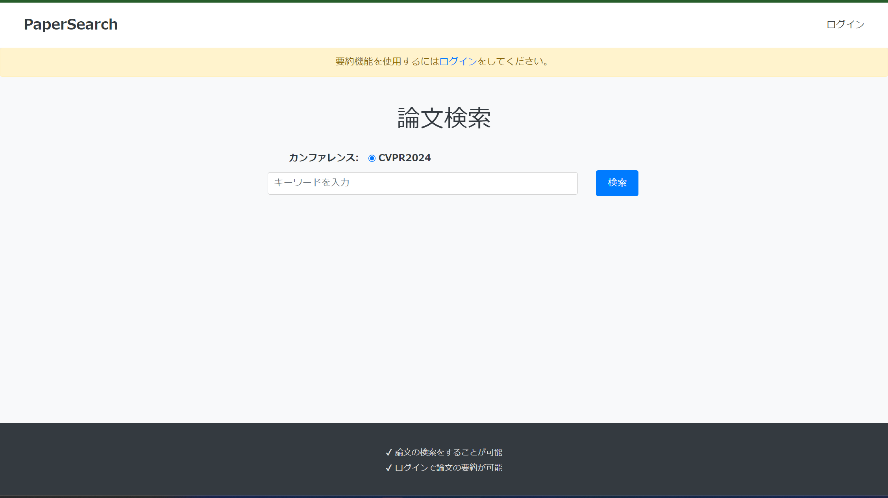
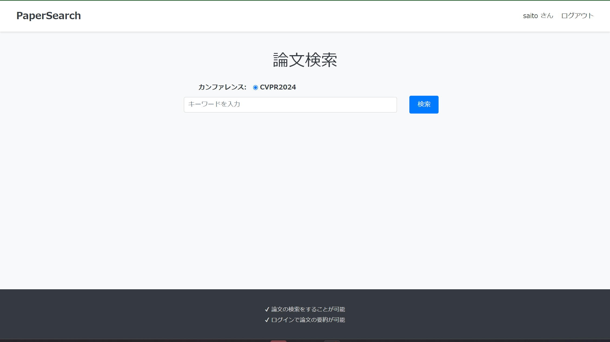
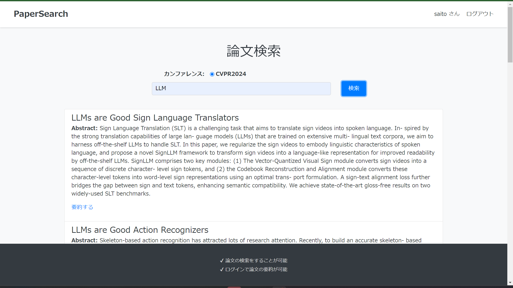
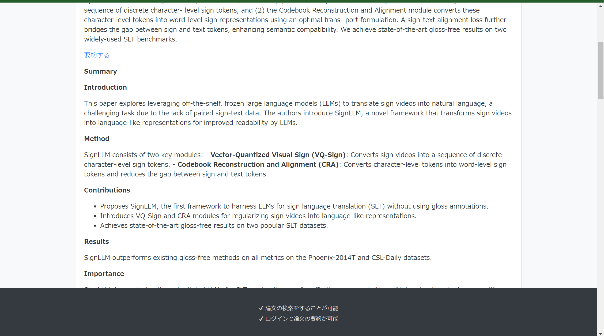
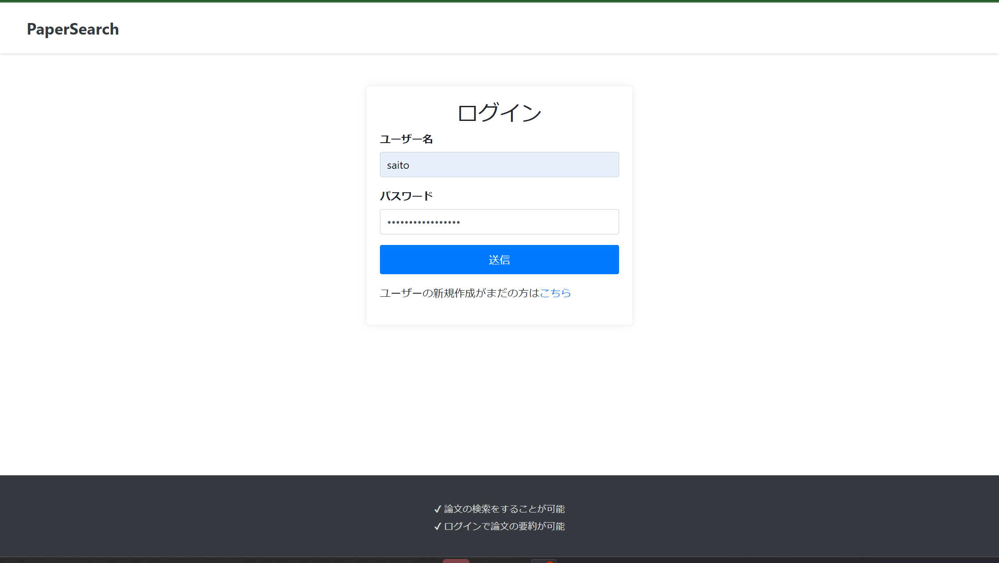
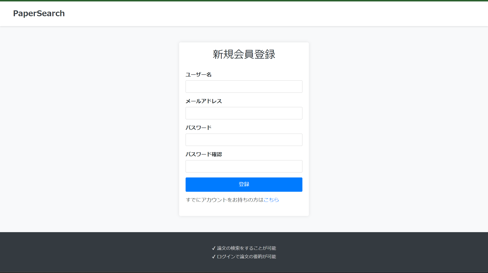

# PaperSearch

## 事前準備
### 実行環境
Ubuntu 24.04

### docker 環境構築
公式の[dockerのインストール方法](https://docs.docker.com/engine/install/)を見てインストール。

### envファイル準備
.envで環境変数を埋め込んでいるため以下のようなファイルを用意する必要がある。
``` bash
MYSQL_ROOT_PASSWORD="your mysql root password"
MYSQL_DATABASE="your database name"
MYSQL_USER="your mysql username"
MYSQL_PASSWORD="your mysql password"
MYSQL_HOST="your host"
ES_HOST="your host"
ES_PORT=9200 # デフォルトでは9200
HUGGINGFACEHUB_ACCESS_TOKEN=""
GOOGLE_API_KEY = ""
```

- HUGGINGFACEHUB_ACCESS_TOKENには[huggingfaceからアクセストークン](https://huggingface.co/settings/tokens)を作成して入力する。
- GOOGLE_API_KEYには[Google AI Studio](https://ai.google.dev/aistudio?hl=ja)でAPIのキーを入力する。

## docker compose の起動
``` bash
cd path to papersearch
docker compose build
docker compose up
```

## クローリング & インデックス作成
以下のシェルを実行
``` bash
./crawling_and_embedding.sh
```
以上が終わると`http://host:8000`で論文の検索が可能になる。

## 補足

## 画面遷移図
### Path: `http://host:8000/`

ログインをしていない初期状態。ヘッダーの下にログインを促すようなアラートの表示。


ログインをしていない状態で、キーワード検索を行った結果。概要は表示されるが要約機能はりようできない。


ログイン後


ログインをした状態で、キーワード検索を行った結果。「要約する」というリンクができている。


論文要約結果


### Path: `http://host:8000/login`

ログイン画面


### Path: `http://host:8000/register`

ユーザー登録


